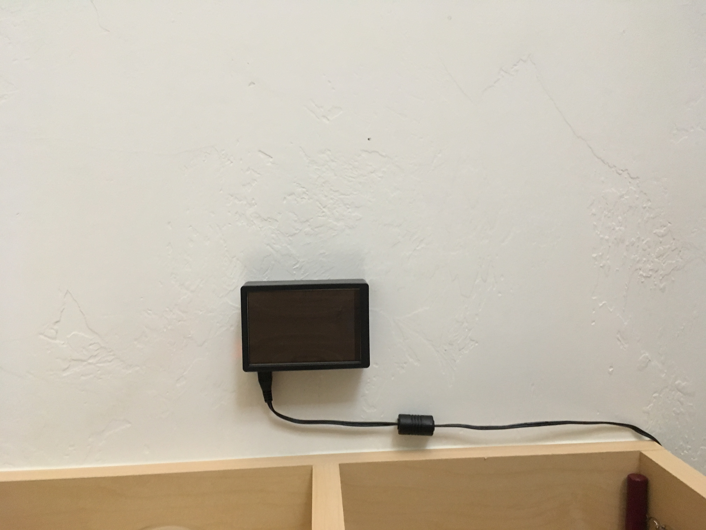
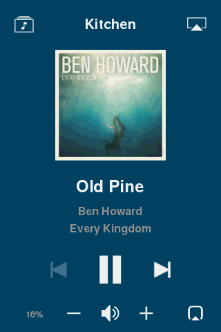
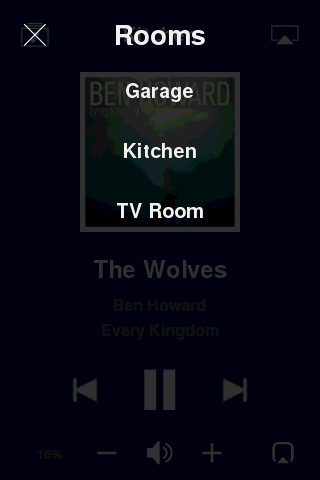
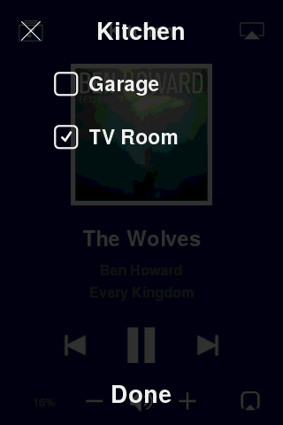
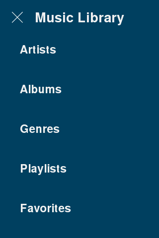
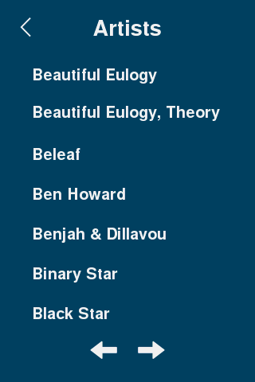
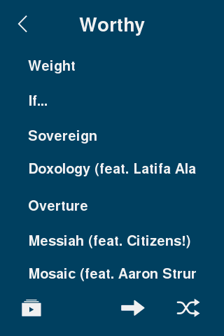
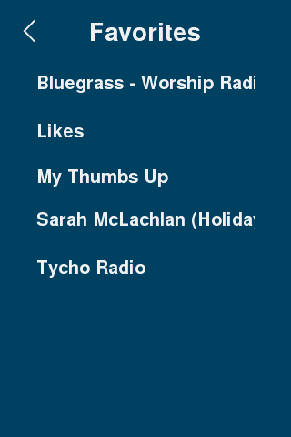

# sonos-pi-controller
A touch screen (Adafruit PiTFT 3.5") Sonos controller for Raspberry Pi. Runs in a docker container.

This controller relies upon the [SoCo library](https://github.com/SoCo/SoCo) for communicating with [Sonos speakers](https://www.sonos.com/en-us/system) and the [pygame library](https://github.com/pygame/pygame) for the UI.




## Features
The sonos-pi-controller includes the following features:

* Familiar interface similar to the official Sonos controller
* Stays synced with all your other Sonos controllers.
* View album art, track name, artist, album
* Select room (top right icon)
* Group rooms (bottom right icon)
* Select music from music library (top left icon)
  * Artists
  * Albums
  * Genres
  * Playlists (Imported Playlists)
  * Favorites (ex. items added to 'My Sonos')
* Play & Pause
* Next & Previous Track
* Adjust volume (including grouped rooms)
* Mute and unmute
* Automatic backlight shutoff after period of inactivity

## Planned Upgrades
* Ability to view song queue, select a song in queue & adjust playback mode (normal, shuffle, repeat)
  * Replace select room icon with a queue icon
  * Room selection will be available via tapping on room name.
  
## Installation & Requirements
### You will need the following hardware:

* Raspberry Pi 3B or armv7 compatible version
  * [Good starter kit if you have nothing](https://www.amazon.com/CanaKit-Raspberry-Starter-Premium-Black/dp/B07BCC8PK7), although it would be cheaper to buy what you need separately
* [Adafruit PiTFT Plus 3.5" Touch Screen](https://www.amazon.com/PiTFT-Plus-480x320-Touchscreen-Raspberry/dp/B017PDWNKE)
* Optional: [Case for mounting to the wall](https://www.amazon.com/gp/product/B07GPV61CJ)

### Installation

* Flash your Raspberry Pi with the latest Raspbian Lite (right now it's *stretch*)
* Login to your Pi via ssh and install docker, docker-compose, and git.
  * [Here](https://www.bargelt.com/setting-up-a-headless-raspberry-pi-with-ssh-docker-docker-compose-git/) is a very helpful guide if you need help.
* Attach your touchscreen to the Pi, reboot, and run the [installer script from Adafruit](https://learn.adafruit.com/adafruit-pitft-3-dot-5-touch-screen-for-raspberry-pi/easy-install-2) to setup your touchscreen.
  * Choose 0 degrees (portrait) for orientation
  * Choose PiTFT as text console.
  * My personal settings in `/boot/config.txt`
    ```bash
    gpu_mem=16
    # --- added by adafruit-pitft-helper Tue 30 Oct 10:12:27 MDT 2018 ---
    dtparam=spi=on
    dtparam=i2c1=on
    dtparam=i2c_arm=on
    dtoverlay=pitft35-resistive,rotate=0,speed=32000000,fps=60
    # --- end adafruit-pitft-helper Tue 30 Oct 10:12:27 MDT 2018 ---
    ```
* Build base Dockerfile image with pygame, pip, and SDL 1.2 support
  ```bash
  docker build -t villarrealized/debian-pygame-base -f Dockerfile.base .
  ```
* Build main Dockerfile image with 
  ```bash
  docker-compose build
  ```
* Copy `sample.env` to `.env` and adjust `BACKLIGHT_TIMEOUT` to your preference. Default is 30 seconds.
* Run `docker-compose up -d` and enjoy your Raspberry Pi Sonos Controller!

## Screenshots









### Troubleshooting
If you have any issues getting started, please reach out and I will try to help.

If your touchscreen is not calibrated correctly, try running the calibration program:
  ```bash
  sudo TSLIB_FBDEVICE=/dev/fb1 TSLIB_TSDEVICE=/dev/input/touchscreen ts_calibrate
  ```

