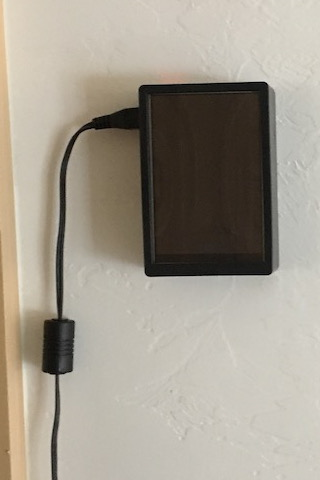

# sonos-pi-controller
A touch screen (Adafruit PiTFT 3.5") Sonos controller for Raspberry Pi. Runs in a docker container.

This controller relies upon the [SoCo library](https://github.com/SoCo/SoCo) for communicating with Sonos speakers.

## Features
The sonos-pi-controller includes the following features:

* Familiar interface similar to the official Sonos controller
* Stays synced with all your other Sonos controllers.
* View album art, track name, artist, album
* Select room (top right icon)
* Group rooms (bottom right icon)
* Select music from music library (top left icon)
  * Artists
  * Albums
  * Genres
  * Playlists (Imported Playlists)
  * Favorites (ex. items added to 'My Sonos')
* Play & Pause
* Next & Previous Track
* Adjust volume (including grouped rooms)
* Mute and unmute
* Automatic backlight shutoff after period of inactivity

## Planned Upgrades
* Ability to view song queue, play different song in queue & adjust playback mode (normal, shuffle, repeat)
  * Replace select room icon with a queue icon
  * Room selection will be available via tapping on room name.

## Screenshots

